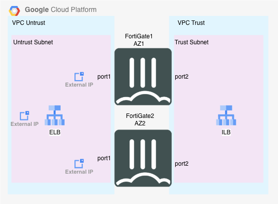

## Solution Description

FortiGate Active-Active High Availability architecture in Google Cloud Platform represents a robust networking solution designed to maximize uptime and performance for enterprise deployments. This configuration deploys multiple FortiGate instances in an active-active cluster where all units simultaneously process traffic, providing both high availability and load distribution capabilities. Unlike traditional active-passive setups, the active-active model leverages GCP's native load balancing services and network infrastructure to distribute traffic across multiple FortiGate instances, ensuring seamless failover and optimal resource utilization. The architecture integrates deeply with GCP's Virtual Private Cloud (VPC) networks, utilizing features such as internal load balancers, external load balancers, and custom routing to create a comprehensive security Solution for North/South and East/West flows.

### Advantages

- **Enhanced Performance**: Parallel processing across multiple active instances
- **Cost Efficiency**: Optimal utilization of all deployed resources
- **Superior Scalability**: Dynamic handling of varying traffic loads
- **High Availability**: Near-zero downtime during maintenance operations or unexpected failures
- **Automatic Failover**: Traffic automatically redistributes among remaining healthy instances
- **Centralized Management**: Simplified administration through FortiManager integration
- **Advanced Security Features**: Support for SD-WAN, SSL inspection, and threat intelligence sharing across the cluster
- **Native GCP Integration**: Comprehensive visibility through GCP's monitoring and logging services

### Challenges

- **Configuration Complexity**: Significantly higher complexity compared to single-instance or Active-Passive deployments
- **Performance Impact**: Session synchronization between active instances can affect performance, particularly for stateful applications.

Session synchronization becomes critical in Active-Active deployments when using Google's Passthrough Network Load Balancer because the load balancer distributes connections based on a 5-tuple hash (source IP, source port, destination IP, destination port, and protocol) without maintaining session state. This means that while new connections from the same client may consistently route to the same FortiGate instance, existing connections could potentially experience issues with asymmetric routing or failover. Without proper session synchronization using FGSP (FortiGate Session Synchronization Protocol), the secondary FortiGate would lack the connection state information, causing active sessions to be dropped and requiring clients to re-establish connections. This is particularly problematic for stateful applications, long-running connections, and services requiring connection persistence, making FGSP essential for maintaining seamless user experience during failover scenarios.

Asymmetric routing can also be addressed using Source Network Address Tranlation (SNAT), which modifies the source IP address of outbount packets to match the FortiGate's interface IP.  This ensures that return traffic is always sent to the correct FortiGate.

## Terraform Resources Deployed

The Active-Active FortiGate solution deploys the following Google Cloud Platform and Fortinet resources:

### Google Compute Resources

- **2x Virtual Private Clouds (VPCs)**: Trust VPC and Untrust VPC for network segmentation
- **2x Subnets**: One subnet each in trust and untrust VPCs (10.15.1.0/24 and 10.15.0.0/24)
- **2x FortiGate Compute Instances**: Active-Active FortiGate firewall VMs deployed in different availability zones
- **2x Additional Persistent Disks**: 30GB log disks attached to each FortiGate instance for logging
- **8x Static IP Addresses**: 
  - 3x External IPs (ELB frontend, FGT1 management, FGT2 management)
  - 5x Internal IPs (ILB frontend, FGT1 trust/untrust interfaces, FGT2 trust/untrust interfaces)
- **2x Firewall Rules**: Ingress rules allowing all traffic for trust and untrust VPCs
- **2x Unmanaged Instance Groups**: One for each FortiGate instance to support load balancer backends

### Google Load Balancer Components

- **1x Regional Health Check**: HTTP health check on port 8008 for FortiGate health monitoring
- **2x Regional Backend Services**: 
  - Internal Load Balancer backend service for north-south traffic distribution
  - External Load Balancer backend service for inbound traffic distribution
- **2x Forwarding Rules**:
  - Internal forwarding rule for traffic from trust network to FortiGates
  - External forwarding rule for inbound internet traffic to FortiGates

### Google Cloud NAT Resources

- **1x Cloud Router**: Provides managed routing for NAT gateway functionality
- **1x Cloud NAT Gateway**: Enables outbound internet connectivity for instances without external IPs

### Google Network Routing

- **1x Custom Route**: Default route (0.0.0.0/0) directing trust network traffic to internal load balancer

### Fortinet Configuration Resources

- **2x FortiGate Configuration Templates**: Bootstrap configurations for each FortiGate instance including:
  - Interface configuration with primary and secondary IPs
  - Admin access and security policies
  - FGSP (FortiGate Session Synchronization Protocol) configuration for session sync
  - Health check probe responses
  - GCP SDN connector for dynamic address object updates
  - Optional BYOL, PAYG, or FortiFlex licensing configuration

## Deploy Sample Terraform

The Terraform templates to deploy this environment are located in the github repository linked to this page.

### How do you run these?

1. Log into GCP console and open a cloud shell.
1. use ``` git clone https://github.com/FortinetCloudCSE/GCP_Solutions.git ``` to clone this repo.
1. move to the Terraform directory by typing ``` cd GCP_Solutions/terraform/gcp-fgt-a_a ```
1. Open `terraform.tfvars.example`Change the name to 'terraform.tfvars' update the required variables (project, region, zone zone2, prefix, fortigate_vm_image, fortigate_machine_type)
1. Run `terraform get`.
1. Run `terraform init`.
1. Run `terraform plan`.
1. If the plan looks good, run `terraform apply`.

### Licensing

There are three options for licensing the FortiGate VMs:

"flex" (default) - Set license_type to "flex" and add two unused FortiFlex tokens to the "flex_tokens" variable.  Ensure you are using the BYOL FortiGate image.  For Example:

```sh
flex_tokens = ["C5095E394QAZ3E640112", "DC65640C2QAZDD9CBC76"]
```

"byol" - Set license_type to "byol" and copy two valid fortigate licenses into the local directory.  Ensure you are using the BYOL FortiGate image. Update terraform.tfvars with the names of the licenses.  For example:

```sh
fortigate_license_files = {
  fgt1_instance    = { name = license1.lic }
  fgt2_instance = { name = license2.lic }
}
```

"payg" - Set license_type to "payg" and ensure that you are using the PAYG FortiGate Image  

If you wish to deploy FortGates in only one zone, you can use the same value for "zone" and "zone2".

FortiGates can be managed by putting `https://<fortigate-public-ip>:8443` into the url bar of your favorite browser. These IP addresses will be part of the Terraform outputs upon using apply.


### FGSP Note

By default, FGSP is disabled.  If you want to enable FGSP of this change the value of the **fgsp** variable to "true" in the terraform.tfvars file.

https://docs.fortinet.com/document/fortigate/7.6.2/administration-guide/668583/fgsp